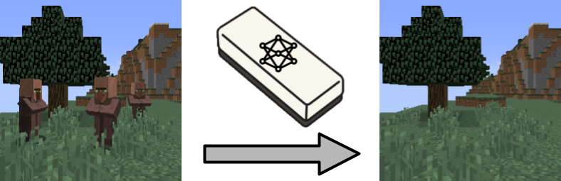
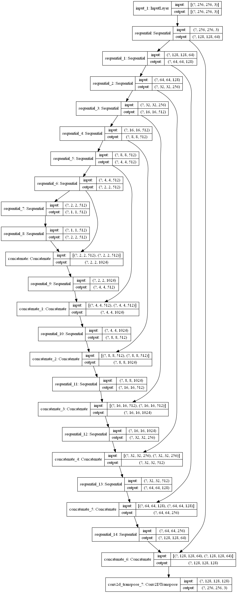
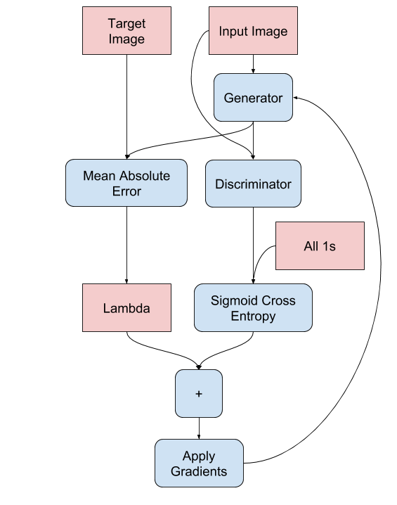
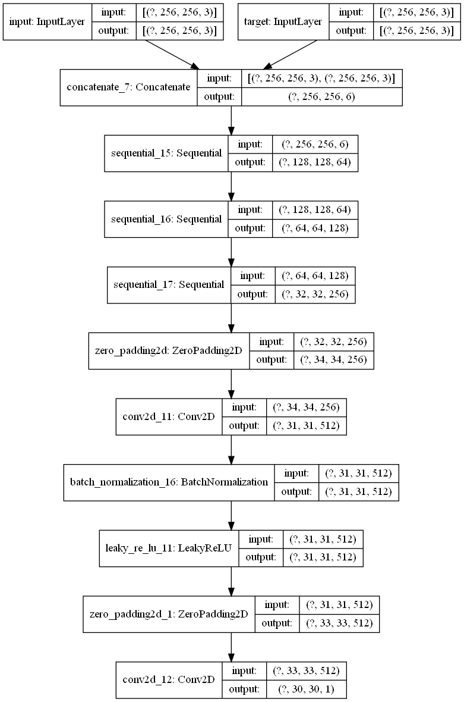
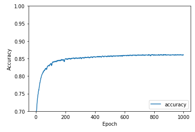
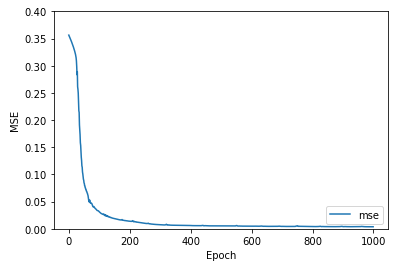
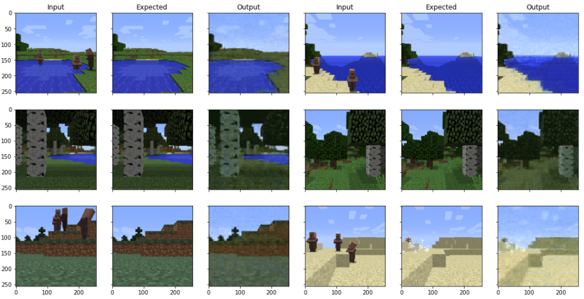
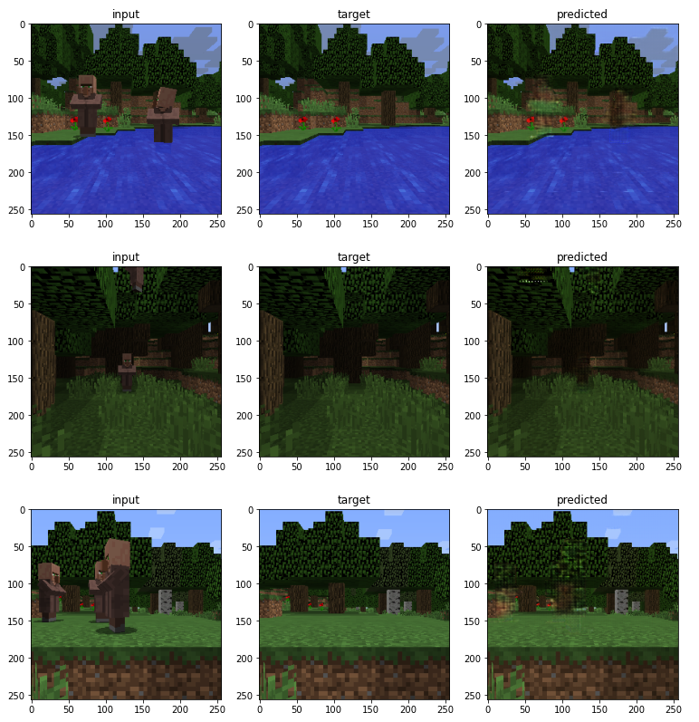
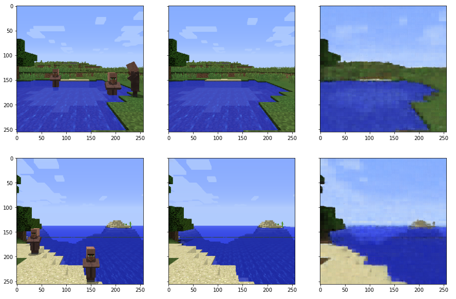
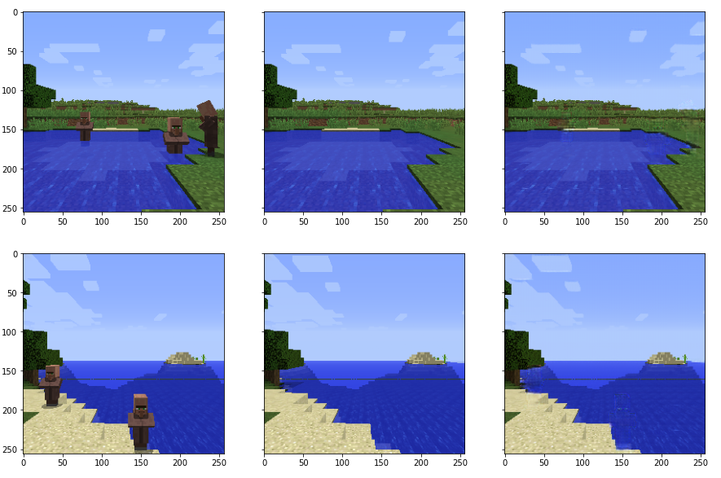

# {{page.title}}

## Video

## Project Summary
The goal of this project is to create a machine learning model to remove villagers from image screenshots taken in minecraft. We want to be able to input an image containing villagers into the model, and have it output an image with no villagers and the background reconstructed as if they were never there.

Machine learning is very useful in this task because it would be very difficult to hard code a program for the infinite amount of villager positions and terrain. Additionally, after removing the villagers from the image, the program must generate a reconstruction of what the background behind the removed villager would look like. A task such as this is infeasible without the utilization of machine learning, since the program must learn how minecraft worlds are laid out and infer the details of the removed section from surrounding attributes and details in the input image. This model could be used to help create screenshots of landscapes in minecraft without having to manually remove villagers or mobs beforehand. It could also be extended to real life scenarios to remove people from landscape shots or remove tourists from personal pictures.

## Approaches

### Gathering Images

The first step to accomplish was to gather a large dataset of paired images to train on. This was done by writing a malmo program which set the screen size to 256 x 256 pixels and teleported the player to a random location in a normally generated minecraft world. The program then checked if the location was good, such as if the player was not in water, in a wall, or on the side of a cliff. If so, it cleared the current mobs on screen and saved the current image of the screen. Then a random amount of villagers was summoned in random locations and another image of the screen was saved. We then manually scanned through the images afterward and removed poor samples, such as when the world had failed to load. We gathered over 3,000 pairs of images to train on using this method.

### Convolutional Autoencoder (CAE)

For our initial model, we created a convolutional autoencoder as a baseline to perform our task. In our model, the encoder took an (256,256,3) tensor as input and was made up of several Conv2D layers with increasing filter size and stride 2 and kernel (2,2), to help with checkerboarding in the reconstruction. The output of the convolutions was then flattened and went through two dense layers to arrive at our compressed latent space representation, which we chose to set at a dimension of 256. The models decoder structure took this latent space vector and passed it through a couple dense layers, and then through some Conv2DTranspose layers that mirrored the encoder’s Conv2D layers and upscaled the compressed representation, resulting in a reconstructed image of the same size, (256,256,3). Our model was compiled with the Adam optimizer with a learning rate of 0.001 and the mean squared error loss function: 

)

The model was then trained with 75% of our collected data for 1000 epochs, where validation was performed using the remaining 25% of the data. As the model trained, we recorded the accuracy and mean squared error for each epoch.

This convolutional autoencoder served as a good baseline model. For the same amount of data that was given to all the models to train and test them, the CAE trained much faster and used less memory. However, the CAE was more prone to overfit the training data, and its images both had a higher error quantitatively, and qualitatively there was a noticeable difference in image clarity, resolution, and sharpness between the CAE and GAN.

### Generative Adversarial Network (GAN)

Our second model we developed was a conditional generative adversarial network based on the Pix2Pix architecture. The Pix2Pix architecture is specifically designed for image to image translation, so this type of model should be great to apply to our problem of removing Minecraft mobs. The GAN consists of two main components, the generator, tasked with creating increasingly real-looking images as the model trains, and the discriminator, which attempts to differentiate between real images and images created by the generator.

The generator follows a similar structure to a modified U-Net, where each downsampling block is composed of three layers: a convolutional layer, a batch normalization layer, and a leaky ReLU layer. The upsampling blocks have four layers: a transposed convolutional layer, a batch normalization layer, an optional dropout layer (typically applied to the first couple layers in the decoder), and a ReLU layer. The downsampling blocks compose the generator’s encoder, while the generator’s decoder is made up of the upsampling blocks. Skip connections are implemented between layers in the encoder and decoder as in any typical U-Net.

{:height="10%" width="10%}

The generator loss function is a combination of the sigmoid cross-entropy between the output image and an array of ones, along with L1 regularization. The sigmoid binary cross-entropy is given by the formula:

&space;=&space;-\sum_ip_i\log{q_i}&space;=&space;-y\ln\hat{y}&space;-&space;(1-y)\ln(1-\hat{y}))

And L1 loss (MAE) is given by the equation:

}{n})

The actual formula for the full generator loss is: total_gen_loss = gan_loss + LAMBDA * l1_loss, where LAMBDA is typically set to 100.

{:height="50%" width="50%"}

The discriminator is a PatchGAN, which specializes in penalizing image structure in relation to local image patches. As it is run convolutionally across the image, it tries to determine whether each n x n patch is real or fake, and averages the result to get the final output. Each discriminator block is made up of a convolutional layer, a batch normalization layer, and a leaky ReLU layer, just like the downsampling blocks from the generator. 

{:height="50%" width="50%"}

The discriminator loss function is the sum of the sigmoid cross-entropy between the real images and an array of ones and the sigmoid cross-entropy between the fake images and an array of zeros.

{:height="50%" width="50%"}

While a GAN trains slower, uses more memory, and requires a bit more data compared to the CAE due to its increased complexity, it is able to produce much clearer images by retaining the areas of the image which do not change unlike the CAE.

### Self-Attention Generative Adversarial Network (SAGAN)

A SAGAN is a GAN augmented with attention layers and spectral normalization in its convolutional and convolutional transposition layers. Typical convolutional networks are constrained by filter size in their ability to represent image data, but the attention layers enable the generator and discriminator to model relations between spatial regions and capture global dependencies. Often this results in better detail handling and GAN performance.

## Evaluation

### Quantitative

As mentioned earlier, our CAE model was tested on 25% of our collected data that we set aside to evaluate its performance. Our two main quantitative metrics we used to evaluate the convolutional autoencoder’s performance were binary accuracy between image pixels and mean squared error between the expected and reconstructed images. One point of evaluation was checking the recorded accuracy and mean squared error values we recorded during our training epochs to ensure the model was training properly, showing clear progress, and was not overfitting or underfitting the data.

 

*Fig.2 Binary pixel accuracy and MSE of the CAE over its 1000 training epochs.*

### Qualitatvie

Additionally, we also visually inspected the recreated images and compared them to the expected result to see how the model was improving and how effective the output was to a human observer, as the whole premise of the project is to remove mobs from screenshots to help people create better and less cluttered images.

*Fig.3 Sample input, expected, and reconstructed output images from the CAE testing.*

Our GAN images were much clearer and  more representative of what one would expect from removing a Minecraft mob. While the CAE struggled with detail loss, noise, and compression when it tried to output sharp images, the GAN was able to capture the original image details flawlessly, minus the exact silhouette where the mobs resided, which had some slightly noticeable pixelation. 

*Fig. 4 Sample input, expected, and reconstructed output images from the GAN testing.*

Directly comparing the images produced by the CAE (top) and the GAN (bottom) easily illustrates the disparity in effictively reproducing the images.

*Fig.5 Input, target, and output for the CAE (top) and GAN (bottom).*
