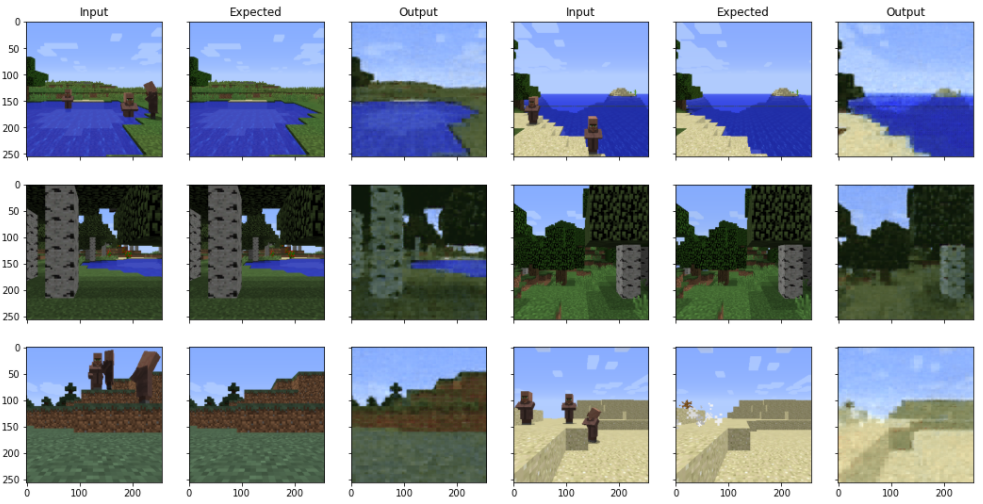

## Project Description
### The goal of this project is to create a machine learning algorithm that will be able to remove villagers and other mobs from images taken in minecraft.

## Explore our Progress:
- ### [Proposal](proposal.html)
- ### [Status](status.html)
- ### [Final](final.html)

## Source code:
### [https://github.com/CoderMisha/Mob-Eraser](https://github.com/CoderMisha/Mob-Eraser)

