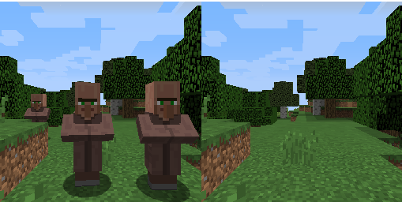

# {{page.title}}

## Project Summary
The purpose of the project is to create an algorithm to remove villagers and other mobs from images in minecraft. Our machine learning model will be trained by feeding it an image containing villagers and other mobs matched with an image with all mobs removed, and it will be tasked with returning a new output image with the mobs erased and background filled in as if they were never there. This algorithm could be used to help players take screenshots of landscapes in minecraft without having to manually remove mobs beforehand, as well as extend to real life scenarios to remove people like tourists from pictures.

## Approach
The first step was obtaining a large dataset of paired images with and without villagers for the model to train on.We did this by creating a malmo script which teleports the player to a random location in a normally generated minecraft world. The script checks if this is a good location by considering factors like if the player is not in water or inside the ground. Then the script gets rid of all the current mobs in view and takes a 256 x 256 pixel screenshot. Next, it spawns a random amount of villagers in random locations and takes another 256 x 265 pixel screenshot. These screenshots are then renamed and saved to their appropriate folders ready to be used to train our model. We also manually scanned through the screenshots beforehand to delete poor samples such as when the world did not load or villagers were out of view. We collected a bit over 2000 pairs of images in total.  

*Fig.1 An example of an image pair, one of many used to train and test the model.*
  
We created a convolutional autoencoder as a baseline model to perform our task. In our model, the encoder took an (256,256,3) tensor as input and was made up of several Conv2D layers with increasing filter size and stride 2 and kernel (2,2), to help with checkerboarding in the reconstruction. The output of the convolutions was then flattened and went through two dense layers to arrive at our latent space representation, which we chose to set at a dimension of 256. The models decoder structure took this latent space vector and passed it through a couple dense layers, and then through some Conv2DTranspose layers that mirrored the encoder’s Conv2D layers, resulting in a reconstructed image of the same size, (256,256,3). Our model was compiled with the Adam optimizer with a learning rate of 0.001 and the mean squared error loss function. The model was then trained with 75% of our collected data for 1000 epochs, where validation was performed using the remaining 25% of the data. As the model trained, we recorded the accuracy and mean squared error for each epoch.
  
## Evaluation
As mentioned earlier, the model was tested on 25% of our collected data that we set aside to evaluate its performance. Our two main quantitative metrics we used to evaluate the autoencoder’s performance were binary accuracy between image pixels and mean squared error between the expected and reconstructed images. One point of evaluation was checking the recorded accuracy and mean squared error values we recorded during our training epochs to ensure the model was training properly, showing clear progress, and was not overfitting or underfitting the data.

*Fig.2 Binary pixel accuracy of the CAE over its 1000 training epochs.*
  
Additionally, we also visually inspected the recreated images and compared them to the expected result to see how the model was improving and how effective the output was to a human observer, as the whole premise of the project is to remove mobs from screenshots to help people create better and less cluttered images.

*Fig.3 Sample input, expected, and reconstructed output images from the CAE testing.*

## Remaining Goals and Challenges
Our convolutional autoencoder prototype serves as a great functioning base case, but it is a bit lackluster when it comes to the quality and accuracy of the reproduced images. In the coming weeks, we aim to surpass its abilities by creating a generative adversarial network with a modified U-Net generator and PatchGAN discriminator as our final model. Then, our CAE will serve as a nice baseline to compare our better model to.

Another major goal for the final report is to create and train our GAN to predict images with all mobs and not just villagers, and to possibly increase the resolution of our images to 512 x 512 or 1024 x 1024 pixels and improve our model to be able to produce images that are more clear at these resolutions. We may also train on different times of day. We did not run into too many issues so far besides understanding how to capture fixed size screenshots with malmo. We still may improve the script to be more stable as well.  Since minecraft has a large array of different mobs, it may pose a problem to be able to remove them all. We plan to overcome this by generating a larger dataset earlier and possibly limiting the types of mobs if removal proves too difficult. Additionally, the GAN likely will prove challenging to implement successfully and effectively, so we plan to conduct a lot of research and construct several simpler prototypes and test with small datasets of a few images before scaling up to a full GAN and full dataset.

## Resources Used
- https://microsoft.github.io/malmo/0.30.0/Schemas/MissionHandlers.html#type_GridDefinition
- https://minecraft.gamepedia.com/Game_rule
- https://www.youtube.com/watch?v=FEB8nUzwCSA&feature=youtu.be
- http://microsoft.github.io/malmo/0.30.0/Documentation/
- https://microsoft.github.io/malmo/0.21.0/Schemas/MissionHandlers.html
- https://www.tensorflow.org/tutorials/generative/autoencoder
- Malmo depth_map_runner.py sample
- Python packages: TensorFlow 2.1.0, Numpy 1.18.1, Pillow 5.4.1, Matplotlib 3.2.1

